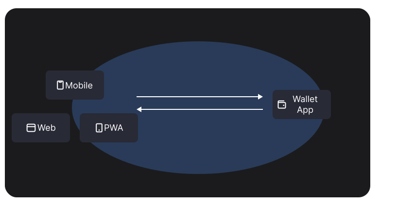

# Mobile Wallet Adapter

import Tabs from '@theme/Tabs';
import TabItem from '@theme/TabItem';
import { FeatureCards, FeatureCard } from '@site/src/components/FeatureCard';
import { Plug, Code, Users } from 'lucide-react';

**Mobile Wallet Adapter (MWA)** is a generic protocol specification that enables dApps to connect with mobile wallet apps for Solana transaction and message signing.

## Features

<FeatureCards>
  <FeatureCard 
    icon={<Plug />}
    title="Unified Wallet Integration" 
    description="Integrate the SDK once and your dApp is compatible with all MWA-compliant wallets." 
  />
  <FeatureCard 
    icon={<Code />}
    title="Simple User Onboarding" 
    description="Users connect and choose a familiar wallet with no additional sign-up steps required." 
  />
  <FeatureCard 
    icon={<Users />}
    title="User Wallet Choice" 
    description="Give users the freedom to connect with their preferred mobile wallet app." 
  />
</FeatureCards>

- Integrate once, connect with any MWA-compliant wallets.
- Zero Cost Wallet Integration
- Freedom of Choice

- Developers only need to implement MWA once to be compatible with [all MWA-compliant wallets](https://solanamobile.com/wallets)! It eliminates the need to integrate with each wallet individually.

- Developers can focus entirely on their dApp's core functionality, with wallet integration handled at no cost.
 
- Users have freedom to select and use the mobile wallet app of their choice.

## Supported Platforms

| Mobile Platform                            | Is MWA Supported? | Notes                                                                 |
| ------------------------------------------ | ----------------- | --------------------------------------------------------------------- |
| Android                                    | ✅                | Full support for dApps and Wallet apps.                               |
| Mobile Web - Chrome (Android)              | ✅                | Automatic integration if using `@solana/wallet-adapter-react`.        |
| iOS                                        | ❌                | MWA is not currently available for any iOS platform (app or browser). |
| Mobile Web - Safari, Firefox, Opera, Brave | ❌                | These browsers currently do not support MWA on Android (or iOS).      |

## Using the SDK

Solana Mobile maintains an official [Mobile Wallet Adapter SDK](https://github.com/solana-mobile/mobile-wallet-adapter) that implements the protocol, originally written as a Android Kotlin/Java library.

<Tabs>
<TabItem value="For dApps" label="For dApps">

The SDK is available for:

- [Kotlin](/android-native/overview)
- [React Native](/react-native/using_mobile_wallet_adapter)
- Flutter
- Unity
- Unreal Engine

Explore the *SDKs* section of the site to learn how to integrate the MWA SDK into the framework of your choice.

</TabItem>
<TabItem value="For Wallets" label="For Wallets">

The SDK is available for:

- [Kotlin](/android-native/overview)
- [React Native](/react-native/using_mobile_wallet_adapter)
- Flutter
- Unity
- Unreal Engine

**Migrating to MWA 2.0**

Check out the [2.0 migration guide](../mwa/migration/overview.md) to migrate from 1.x version of Mobile Wallet Adapter to the latest version. 

</TabItem>
</Tabs>